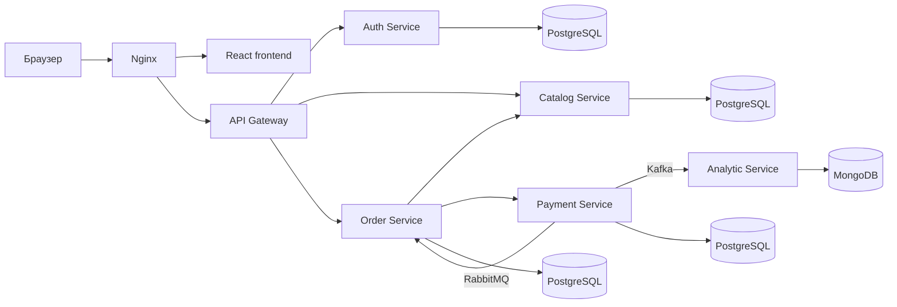

# OrderFlow Platform

OrderFlow — учебная микросервисная платформа интернет-магазина. Пользователь регистрируется, просматривает каталог, создаёт заказ и наблюдает за изменением статуса оплаты. Сервисы запускаются в Docker Compose и взаимодействуют через HTTP, RabbitMQ и Kafka.

## Архитектура



| Компонент | Назначение |
| --- | --- |
| `frontend` | Витрина, корзина, регистрация и оформление заказа |
| `api-gateway` | Единая точка входа для клиентского API и проверка JWT |
| `auth-service` | Регистрация, вход, хеширование паролей и выпуск JWT |
| `catalog-service` | Хранение и выдача товаров |
| `order-service` | Создание заказов и отслеживание результата оплаты |
| `payment-service` | Имитация оплаты и публикация событий |
| `analytic-service` | Получение платёжных событий из Kafka и запись в MongoDB |
| `nginx` | Публикация frontend и маршрутизация `/api/*` |

## Требования

- Docker Desktop для Windows/macOS или Docker Engine с Compose plugin для Linux;
- Git;
- минимум 4 ГБ свободной оперативной памяти для полного набора контейнеров;
- свободные порты `8080`, `5672`, `9092`, `15672` и `8005` либо другие значения в env-файлах.

Проверить Docker:

```bash
docker version
docker compose version
```

## Быстрый запуск

Все команды Docker Compose выполняются из каталога `infra`.

### 1. Настроить окружение

В PowerShell:

```powershell
cd infra
Copy-Item .env.core.example .env.core
Copy-Item .env.analytic.example .env.analytic
```

В Bash:

```bash
cd infra
cp .env.core.example .env.core
cp .env.analytic.example .env.analytic
```

Откройте `.env.core` и `.env.analytic` и замените все значения `replace-with-...` уникальными случайными строками. Для паролей в URL используйте только URL-безопасные символы; удобнее всего шестнадцатеричные строки.

Сгенерировать подходящее значение можно командой:

```bash
python -c "import secrets; print(secrets.token_hex(32))"
```

Для `JWT_SECRET` рекомендуется выполнить команду с `token_hex(64)`. Не добавляйте настоящие `.env` в Git: репозиторий отслеживает только `.env.*.example`.

Локальные значения Kafka уже настроены так:

```dotenv
KAFKA_BIND_HOST=127.0.0.1
KAFKA_EXTERNAL_HOST=127.0.0.1
KAFKA_BOOTSTRAP_SERVERS=kafka:29092
```

### 2. Запустить основные сервисы

```bash
docker compose --env-file .env.core -f docker-compose.core.yml up -d --build
```

Проверить состояние:

```bash
docker compose --env-file .env.core -f docker-compose.core.yml ps
```

После запуска приложение доступно по адресу:

- магазин: <http://localhost:8080>;
- RabbitMQ Management: <http://localhost:15672> — логин и пароль берутся из `RABBITMQ_USER` и `RABBITMQ_PASSWORD`.

Каталог после первого запуска пуст. Создать демонстрационный товар можно из Git Bash или WSL:

```bash
bash ../create_product_script.txt
```

Команда должна выполняться из каталога `infra` при запущенном `catalog-service`.

### 3. Запустить аналитику

После запуска core-стека:

```bash
docker compose --env-file .env.analytic -f docker-compose.analytic.yml up -d --build
```

Проверить аналитику:

```bash
docker compose --env-file .env.analytic -f docker-compose.analytic.yml ps
```

Список сохранённых событий доступен по адресу <http://localhost:8005/events>.

## Основные API-маршруты

Frontend обращается к API через Nginx с префиксом `/api`:

| Метод | Маршрут | Назначение |
| --- | --- | --- |
| `POST` | `/api/auth/register` | Регистрация и получение JWT |
| `POST` | `/api/auth/login` | Вход и получение JWT |
| `GET` | `/api/auth/me` | Получение текущего пользователя |
| `GET` | `/api/products` | Список товаров |
| `GET` | `/api/products/{id}` | Один товар |
| `POST` | `/api/orders` | Создание заказа, требуется Bearer-токен |
| `GET` | `/api/orders/{id}` | Получение статуса заказа, требуется Bearer-токен |

## Логи

Логи всего core-стека:

```bash
docker compose --env-file .env.core -f docker-compose.core.yml logs -f
```

Логи отдельного сервиса:

```bash
docker compose --env-file .env.core -f docker-compose.core.yml logs -f order-service
```

Логи аналитики:

```bash
docker compose --env-file .env.analytic -f docker-compose.analytic.yml logs -f analytic-service
```

Выйти из просмотра логов можно сочетанием `Ctrl+C`; контейнеры продолжат работать.

## Остановка

Сначала остановите аналитику, затем основной стек:

```bash
docker compose --env-file .env.analytic -f docker-compose.analytic.yml down
docker compose --env-file .env.core -f docker-compose.core.yml down
```

Обычный `down` не удаляет данные PostgreSQL, MongoDB и Kafka. Команда `down -v` удаляет volumes и все хранящиеся в них данные — не используйте её без необходимости и резервной копии.

## Проверка конфигурации

Проверить Compose-файлы без запуска контейнеров:

```bash
docker compose --env-file .env.core -f docker-compose.core.yml config --quiet
docker compose --env-file .env.analytic -f docker-compose.analytic.yml config --quiet
```

Успешная проверка ничего не выводит и завершается с кодом `0`.

## Запуск на сервере

Для размещения core и analytics на разных серверах:

1. Укажите приватный IP core-сервера в `KAFKA_BIND_HOST` и `KAFKA_EXTERNAL_HOST`.
2. В `KAFKA_BOOTSTRAP_SERVERS` аналитического сервера укажите `<private-core-ip>:9092`.
3. Разрешите Kafka-порт `9092` только между доверенными серверами.
4. Ограничьте внешний доступ к RabbitMQ и базам данных.
5. Храните `.env` с правами только для владельца (`chmod 600 .env.core .env.analytic` на Linux).
6. Для публичного доступа разместите сервис за HTTPS reverse proxy.

## Типичные проблемы

### Docker daemon не запущен

Если появляется сообщение `failed to connect to the docker API`, запустите Docker Desktop или службу Docker Engine.

### Не задана обязательная переменная

Сообщение вида `VARIABLE is required` означает, что значение отсутствует в соответствующем `.env`. Сравните файл с актуальным `.env.*.example`.

### Пароли изменились, а volumes остались

PostgreSQL и MongoDB применяют начальные логины и пароли только при создании нового хранилища. Если контейнеры ранее запускались с другими значениями, изменение `.env` не меняет пароль внутри существующей базы. Сохраните нужные данные и либо измените пароль в самой базе, либо осознанно пересоздайте соответствующий volume.

### Аналитика не подключается к Kafka

- при запуске на одном Docker-хосте используйте `KAFKA_BOOTSTRAP_SERVERS=kafka:29092`;
- на разных серверах используйте приватный IP core-сервера и проверьте доступность порта `9092`;
- core-стек должен быть запущен раньше analytics.

### Порт уже занят

Измените внешний порт в `.env.core` или `.env.analytic`, не меняя внутренние порты контейнеров.
